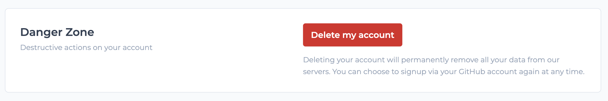
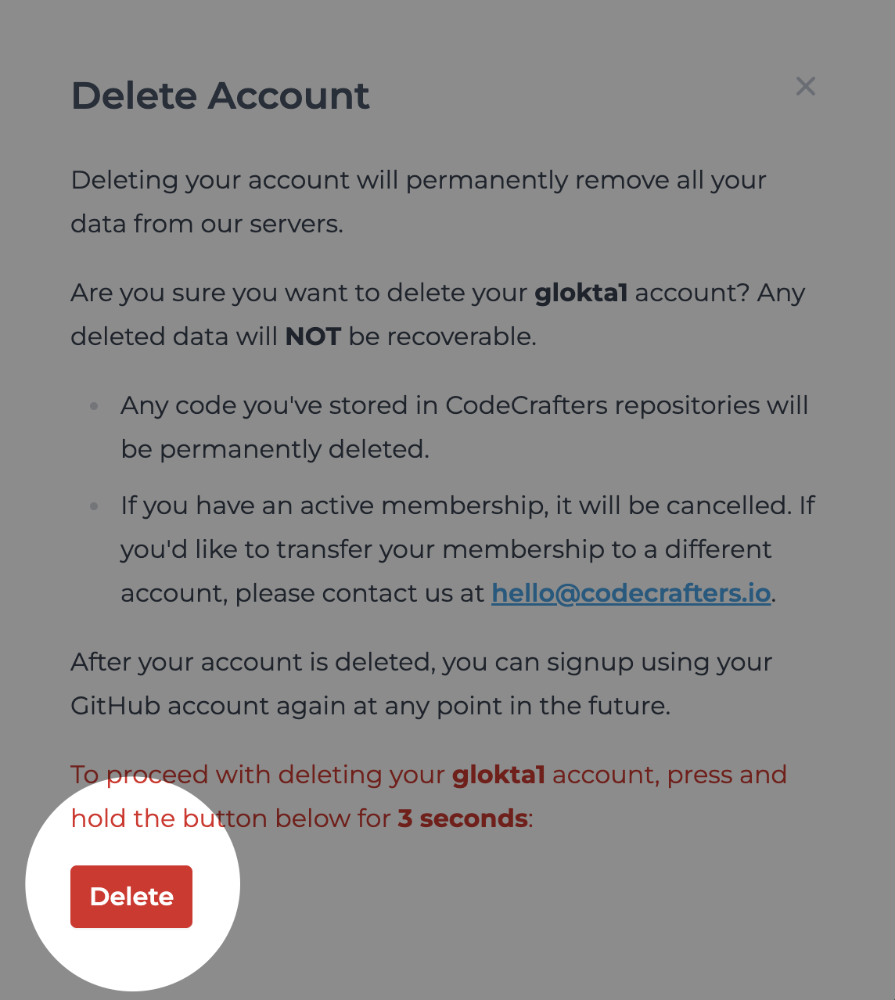

To delete your CodeCrafters account and all associated data, follow these steps:

1. Click on your username on the top right corner of the page.
2. Select **Settings** from the dropdown menu.
3. Switch to the **Account** tab
   <Frame>
     
   </Frame>
4. Locate the **Danger Zone** section and click on **Delete my account**.
   <Frame>
     
   </Frame>
5. In the modal, **press** and **hold** the `Delete` button for _3 seconds_ to confirm deletion of your account.
   <Frame>
     
   </Frame>
