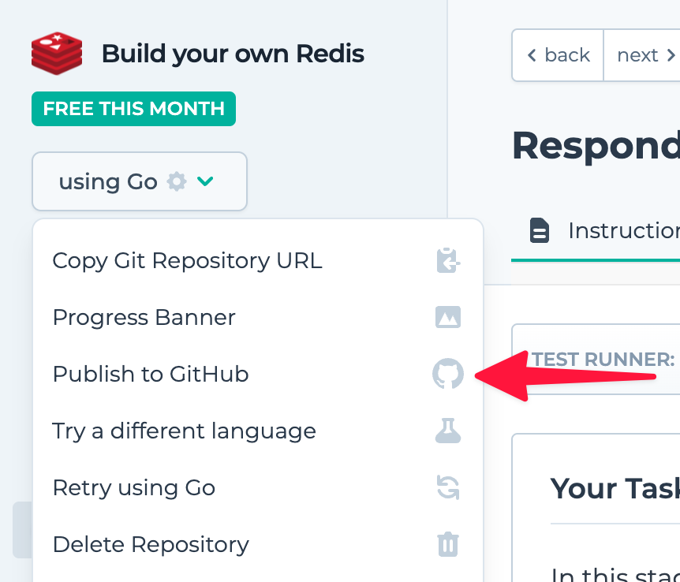

This integration allows users to publish their projects from the CodeCrafters platform to GitHub with just a couple of clicks. Each course available on CodeCrafters, such as "Redis in Go", now includes an option in the language dropdown menu to **"Publish to GitHub"**:

<Frame>
  </img>
</Frame>

## Frequently Asked Questions

### Is there a limit to how many projects I can publish to GitHub?
No, you can publish as many projects as you like.

## Who can see my published projects?
This is up to you. You can set this in the privacy settings of your GitHub repository. 

### Can I update a project once it's been published?
Yes! Any subsequent changes made to your Codecrafters project will be automatically synced with your GitHub repo. 