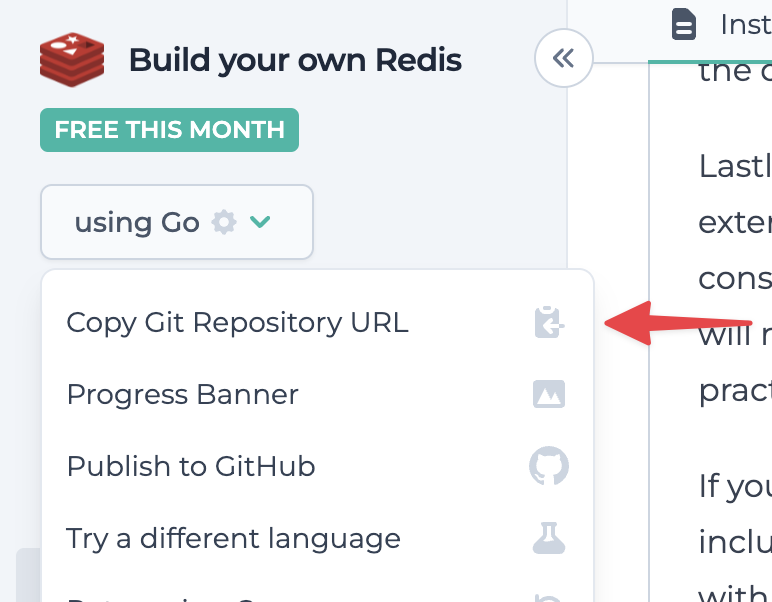

When pushing your changes, you might see a message indicating that some files exceed the 1MB size limit:

<Frame>
  </img>
</Frame>

If you encounter an error like this, it's likely due to inadvertently committing files that are too large or not meant to be tracked (e.g., binaries or `node_modules/`).

Depending on when these large files entered your Git history, there are two ways to resolve this.

## Solution 1: Amend last commit (Try this first)

<Steps>
  <Step title="Stage the large files for deletion">
    Run the following command:
    ```bash
    git rm LARGE_FILE
    ```
    This command removes the large files from your Git repository and locally.

    For example to delete the `./server` and `./release/target` binaries shown in the screenshot above, run the following command:

    ```bash
    git rm server release/target
    ```

  </Step>
  <Step title="Commit the changes">
    ```bash
    git commit --amend --no-edit --allow-empty
    ```

    This will amend the previous commit with the changes.

  </Step>
  <Step title="Push the code">
  Finally, push your code:
  ```bash
  git push origin master
  ```
  </Step>
</Steps>

If Solution 1 doesn't work, it means the large files are present in an older commit and will require some extra work. Follow the instructions in Solution 2 below.

## Solution 2: Amend historical commits

<Steps>
  <Step title="Install `git repo-filter`">
    You can install [git-filter-repo](https://github.com/newren/git-filter-repo) manually or by using a package manager. For example, to install the tool with Homebrew, run the following command:
    ```bash
    brew install git-filter-repo
    ```

    For more information, see [INSTALL.md](https://github.com/newren/git-filter-repo/blob/main/INSTALL.md)

  </Step>
  <Step title="Delete the large files">
  Delete each of the large files using the following command:
  ```bash
  git filter-repo --invert-paths --path PATH-TO-LARGE-FILE
  ```
  This will remove the file from your Git history and local filesystem.
  <Note>Add the *path* to the files you want to remove, not just their filename.</Note>
  </Step>

<Step title="Restore your remotes and push">
The `git filter-repo` tool will automatically remove your configured remote CodeCrafters Git repository. Restore it using the following steps:

Copy the CodeCrafters Git repository URL from the dropdown menu:

<Frame>
  </img>
</Frame>

Run the following command in your local project folder:

```bash
git remote add origin CODECRAFTERS-GIT-URL
```

Finally, force-push your code:

```bash
git push origin --force --all
```

</Step>

</Steps>

<Note>
  If you're still running into issues after trying the the two steps above,
  please reach out to us at
  [hello@codecrafters.io](mailto:hello@codecrafters.io) and we'll help out!{" "}
</Note>
