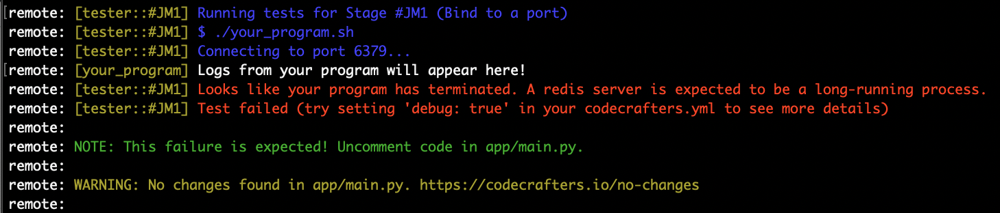

When pushing your changes, you might see a message indicating that no changes were found.

<Frame>
  </img>
</Frame>

This most likely means that you haven't run `git add .` before running `git commit` and `git push`.

Make sure to run all these three commands in order:

```sh
git add .
git commit -m "<your_commit_message>"
git push origin master
```

## Everything up-to-date

After pushing your changes, if you see "**Everything up-to-date**", ensure you’ve saved all changes to your files before attempting to push again.

<Frame>
  
</Frame>
